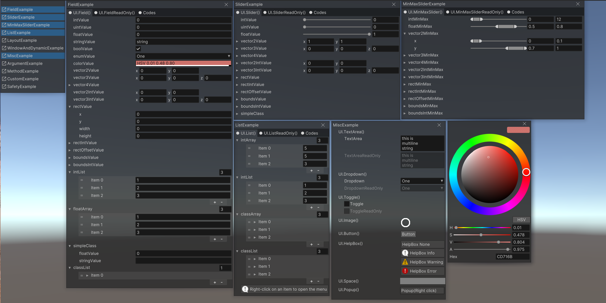

# RosettaUI

Code-based UI library for development menu for Unity




```csharp
public class ExampleSimple : MonoBehaviour
{
    public string stringValue;
    public float floatValue;
    public int intValue;
    public Color colorValue;

    
    void Start()
    {
        var root = GetComponent<RosettaUIRoot>();
        root.Build(CreateElement());
    }

    Element CreateElement()
    {
        return UI.Window(nameof(ExampleSimple),
            UI.Page(
                UI.Field(() => stringValue),
                UI.Slider(() => floatValue),
                UI.Row(
                    UI.Field(() => intValue),
                    UI.Button("+", () => intValue++),
                    UI.Button("-", () => intValue--)
                ),
                UI.Field(() => colorValue)
            )
        );
    }
}
```


# Installation

This package uses the [scoped registry] feature to resolve package
dependencies. 

[scoped registry]: https://docs.unity3d.com/Manual/upm-scoped.html


**Edit > ProjectSettings... > Package Manager > Scoped Registries**

Enter the following and click the Save button.

```
"name": "fuqunaga",
"url": "https://registry.npmjs.com",
"scopes": [ "ga.fuquna" ]
```


**Window > Package Manager**

Select `MyRegistries` in `Packages:`


Select `RosettaUI - UI ToolKit` and click the Install button


# How to use

1. Put `Packages/RosettaUI - UIToolkit/RosettaUIRootUIToolkit.prefab` in the Hierarchy
1. Write code to generate `Element` instance
1. Call `RosettaUIRoot.Build(Element)` to generate the actual UI ( [Example] )

[Example]: Assets/Example/ExampleSimple.cs

Examples are available in this repository.
I recommend downloading and checking it out.


# Functions

## UI.Field()


<p float="left">


</p>


## UI.Slider()

<p float="left">


</p>

## UI.MinMaxSlider()

<p float="left">


</p>


## UI.List()

<p float="left">


</p>

## Layout elements

<p float="left">


</p>

## And more...
Please check the [Examples](Assets/Scenes)

# Enviroment

| Platform | Support           |
| -------- | ----------------- |
| Windows  | ✔                 |
| Mac      | Maybe(not tested) |
| Linux    | Maybe(not tested) |
| IL2CPP   | Suspended         |

| UI Library | Support      |
| ---------- | ----------- |
| UI Toolkit | ✔           |
| UGUI       | Suspended   |
| IMGUI      | Not planned |


# See also

[PrefsGUI](https://github.com/fuqunaga/PrefsGUI) - Accessors and GUIs for persistent preference values using a JSON file
